# diy-cloud-gaming-desktop

This is a proof of concept of using AWS GPU instance and Spot Instance to build a powerful and cost-effective Steam-powered cloud gaming desktop.

I like to play PC games, occasionally. The XCOM franchise is one of my favorites, but the latest XCOM 2 title is a power-hungry application and my Microsoft Surface Pro can't support it. With cloud-gaming, it's possible to enjoy modern games on a low-end spec computer. The idea is that the actual game is run on a powerful machine in the cloud, and is played through a terminal over broadband network.

Demo:


(it looks way better in real life than in this potato-quality GIF)

### EC2 GPU-accelerated Instance

AWS EC2 G family instance types are optimized for graphics-intensive application such as 3D visualizations, mid to high-end virtual workstations, virtual application software, 3D rendering, application streaming, video encoding, gaming, and other server-side graphics workloads.

[Announced](https://aws.amazon.com/blogs/aws/build-3d-streaming-applications-with-ec2s-new-g2-instance-type/) in 2013, G2 instance type has the following specification:
- NVIDIA GRID (GK104 “Kepler”) GPU (Graphics Processing Unit), 1,536 CUDA cores and 4 GB of video (frame buffer) RAM.
- Intel Sandy Bridge processor running at 2.6 GHz with Turbo Boost enabled, 8 vCPUs (Virtual CPUs).
- 15 GiB of RAM.
- 60 GB of SSD storage.

NVIDIA GRID GPUs are optimized for graphics rendering accuracy, and it is more than able to support modern games. Maybe not the most cost-effective graphic platform to play games, but you can do it.

### Compute Cost

In Singapore (ap-southeast-1) region, G2 Windows instance is offered at $1.16 per hour for on-demand pricing. This price point may look cheap at a glance ("hey, it's just a buck!"), but if you use it for many hours, it adds up and you may end up with a bill shock. If I use it for 20 hours in a month, I will be paying $23.2.

To get a big EC2 discount without long-term commitment, we can use Spot Instance. There are two Spot strategies we can choose from: regular Spot Instance which has lower price point but higher chance of interruption, or Defined-Duration Spot (also called Spot-Block) which has higher price point but much lower chance of interruption. Both strategies allow you to get big discount than On-Demand. I've got $0.46 and $0.66 per hour pricing for regular Spot Instance and Spot-Block, respectively. This translates to $9.2 and $13.2 for 20 hours of use. This is way more affordable!

### Problem

When an instance is launched from Spot request, it is launched from an image (AMI). This means, the underlying EBS volumes are restored from snapshots, including the primary (boot) volume and any additional block devices.

Taken from https://docs.aws.amazon.com/AWSEC2/latest/UserGuide/ebs-initialize.html:

> New EBS volumes receive their maximum performance the moment that they are available and do not require initialization (formerly known as pre-warming). However, **storage blocks on volumes that were restored from snapshots must be initialized (pulled down from Amazon S3 and written to the volume) before you can access the block. This preliminary action takes time and can cause a significant increase in the latency of an I/O operation the first time each block is accessed**. For most applications, amortizing this cost over the lifetime of the volume is acceptable. Performance is restored after the data is accessed once.
>
> You can avoid this performance hit in a production environment by **reading from all of the blocks on your volume before you use it; this process is called initialization. For a new volume created from a snapshot, you should read all the blocks that have data before using the volume.**

The EBS initialization process and the reading of all blocks can impact the game performance.

To avoid this situation, we decouple the game data from the AMI. Game data will be stored in a separate, persistent EBS volume, which will not be part of the AMI. When the instance is launched, the EBS volume will be attached and assigned drive letter D. This means, the EBS volume does not need to be initialized; it is warm all the time.

It's also important that game data is decoupled from the AMI too, so that it survives instance termination. Some games store save data and config files in "Documents" folder. In that case, we can move the underlying location of this folder to D: drive.

Note: Since the EBS volume is persistent, we will need to pay it separately. General Purpose SSD (gp2) is priced at $0.12 per GB-month. So, a 120 GB volume will cost $14.4 per month. You may want to opt for EBS Throughput Optimized HDD (st1) Volumes, which is priced at $0.054 per GB-month. This is about 50% cheaper than GP2, but will give different performance characteristics.

The rest of the document will describe how to do this.

# Disclaimer

This guide is intended for people who already have decent experience of using AWS and understand what they are doing.

I will not be responsible for any issues or cost incurred as a result of following (or not following) the steps in this document. Use this guide at your own risk.

# Pre-Requisites

## Pre-Req 1: Choose the Closest AWS Region to You

Latency and bandwidth will be one of the key constraints of any cloud-based desktop. Choose an AWS region closest to you.

After logging in to your AWS account, choose the region at the top right corner:

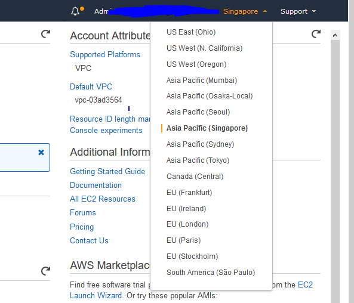

## Pre-Req 2: VPC with public subnet

A VPC with public subnet is necessary to be able to connect via RDP. If you have other means of connection (e.g. Parsec), then launching the instance in private subnet is okay.

## Pre-Req 3: AWS CLI installed and configured in your terminal computer

The AWS CLI needs to be configured with an IAM Role or IAM User having necessary EC2 permissions. This includes sending Spot Request, describing Spot requests, EBS volume and Elastic IP operations.

# (Optional) Step 1: Create a KeyPair

If you don't already have a keypair in the region of your selection, please create one. A keypair is required to be able to launch and connect to a Windows instance from AWS-maintained AMIs.

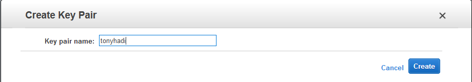

# Step 2: Create a Security Group

Create a security group where it allows All Traffic (or at least RDP connection) from *your IP address only*. It's extremely important to limit access to your own IP to prevent malicious attempts of logging in to your instance.  

# Step 3: Create an EBS Volume for Storing Game Data

Create a General Purpose SSD (gp2) volume. A 120 GB volume should be able to house a modern game installation files and leaves a little bit of room for an extra smaller-sized game.

> **After creating, note down the EBS volume ID, e.g vol-12345678901234567**

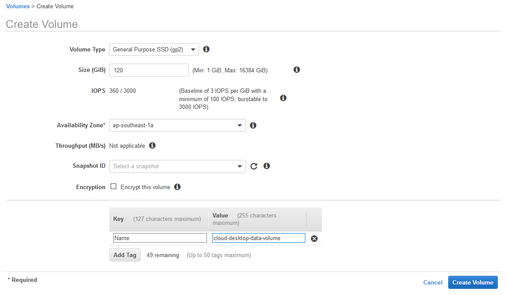

# (Recommended) Step 4: Allocate an Elastic IP Address

An Elastic IP means a consistent IP address you can connect to, if you use RDP. This EIP will be associated when you launch an instance, and disassociated when the instance is terminated.

> **Note down the EIP allocation ID, e.g. eipalloc-12345678901234567**

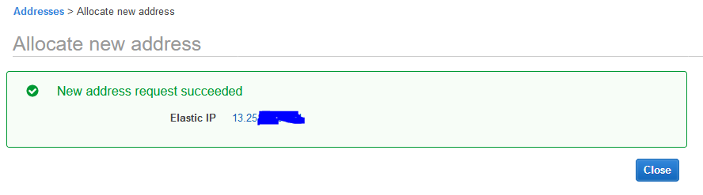

# Step 5: Launch a g2.2xlarge Instance for Imaging Purpose

Go to EC2 console, and launch an instance for imaging purpose.

Choose Windows Server 2016 Base:

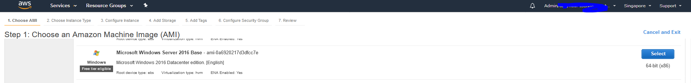

Choose g2.2xlarge for the instance type:

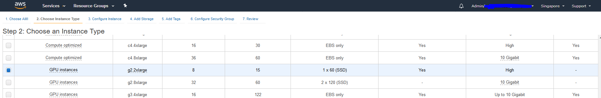

In the Launch Instance Step 3: Configure Instance Details, leave as default and continue to the next Step, Storage.

Leave the Root volume as 30 GB General Purpose SSD (gp2). You may opt to remove "Instance Store 0" as we won't be using it.

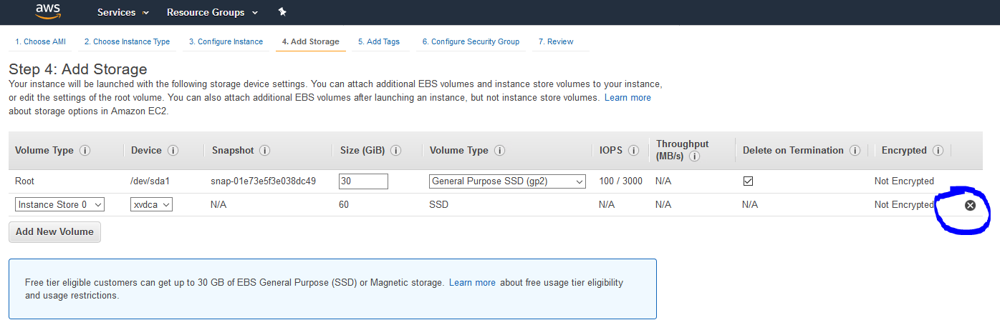

Add a Name tag to the instance.

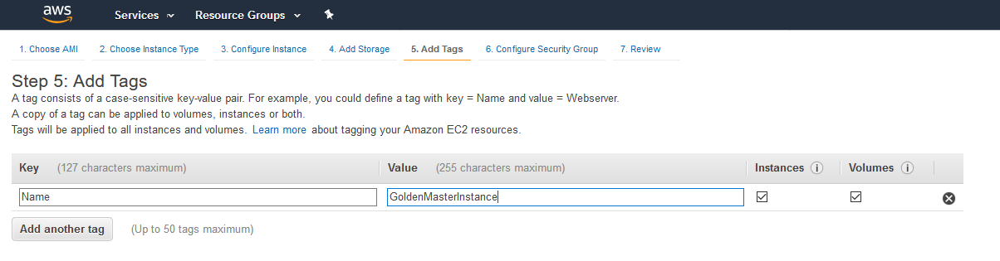

Choose the security group created in the previous step. 


Review everything and launch the instance.

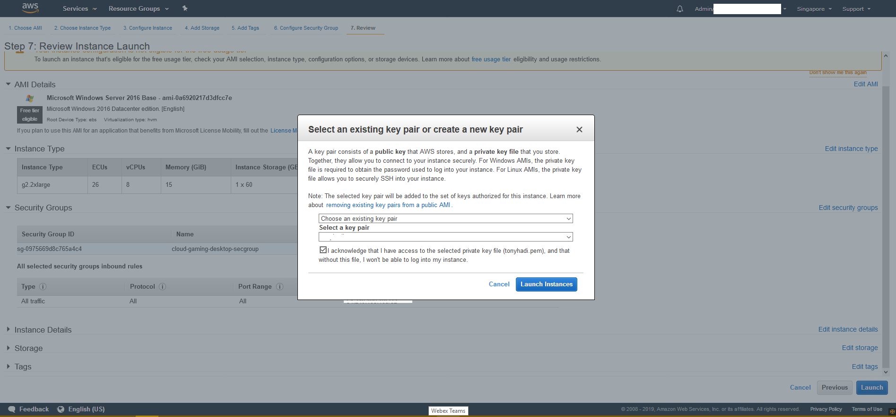

It will take a few minutes for the instance to be ready. In the mean time, we can do other steps first.

# Step 6: Associate the Elastic IP to the Instance

Associate the Elastic IP created in the previous Step  to the instance.

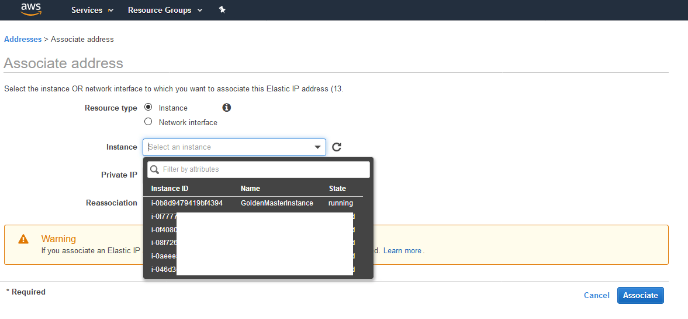

# Step 7: Attach the EBS Volume to the Instance

Attach the EBS volume to the instance as `xvdf` device.

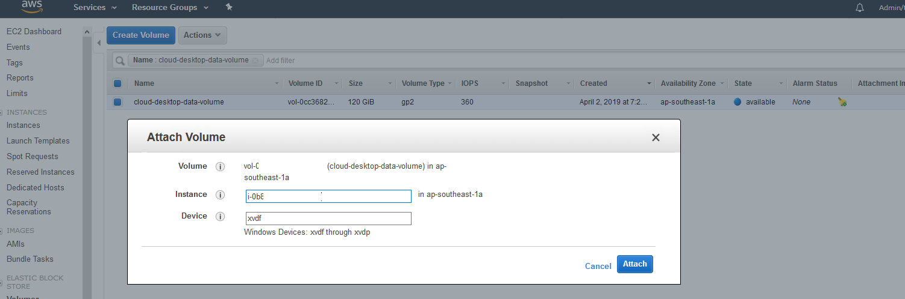

# Step 8: Decrypt Windows Password

After a few minutes, you can retrieve the Administrator password by right-clicking the instance, choose "Decrypt Windows Password. Upload the PEM file you have obtained from previous step (Keypair).

> **Note down the Administrator password you obtained** 

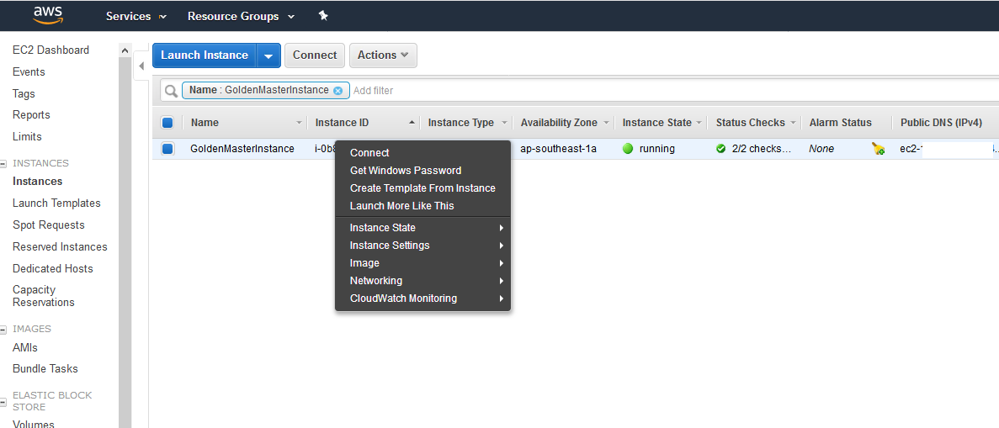

# Step 9: Configure the Instance

## Step 9A: Connect to the Instance via RDP

Connect to the instance via RDP, either to the Elastic IP (if you created it) or to the public IP / DNS name of the instance. Acknowledge all warnings.

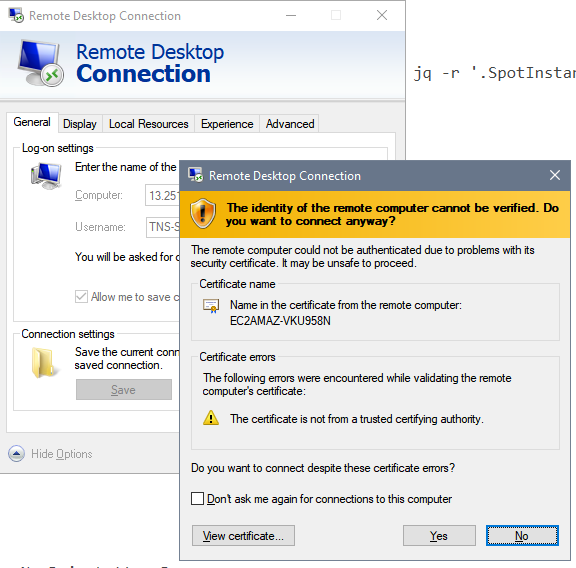

## Step 9B: (Recommended) Install Mozilla Firefox

Installing Firefox is optional but is highly recommended. This is one thing that I always do first when working with a fresh install of Windows. It makes it easier to download additional files or software from non-Microsoft websites.

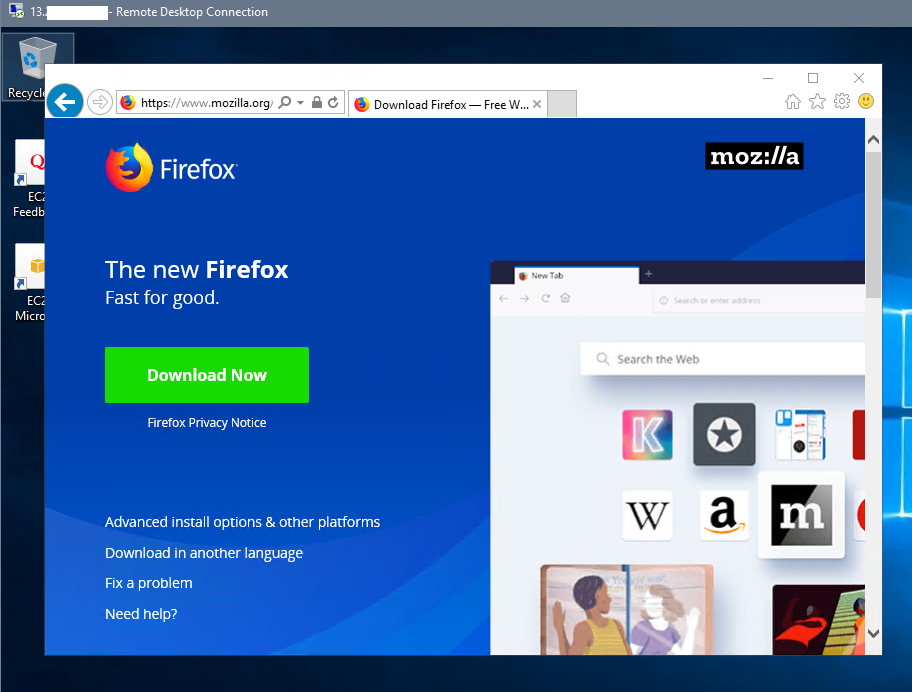

## Step 9C: Prepare the EBS Volume Drive

Run `diskmgmt.msc` command to open Disk Management.

You will see the 120 GB volume which is the EBS volume attached to xvdf. Right-click the volume, choose "Online".


Initialize the disk by right-clicking it, and choose "Initialize". Choose MBR partition style.

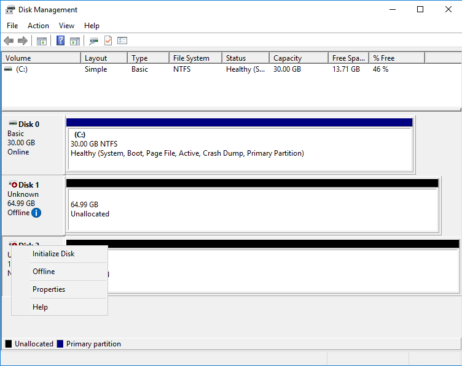

After the disk is initialized, create a partition by right-clicking it, and choose "New simple volume". Size up the partition to fill all disk space. Assign drive letter D, and choose Quick Format with NTFS file system.

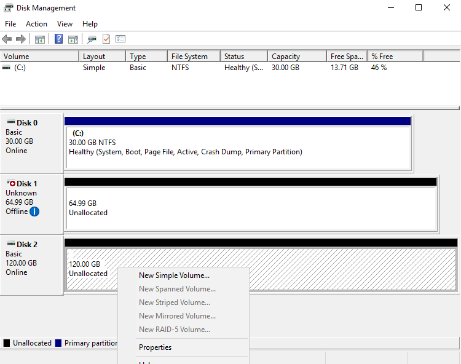

## Step 9D: Install NVIDIA Graphics Driver

Follow the instruction in this page to download and install NVIDIA Graphics Driver:

https://docs.aws.amazon.com/AWSEC2/latest/WindowsGuide/install-nvidia-driver-windows.html

G2 instance type is based on GRID K520 architecture:

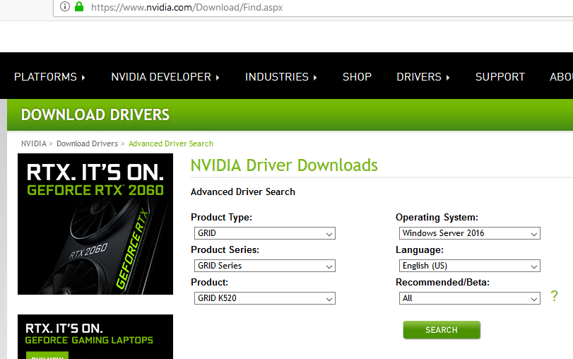

Choose the latest version available:

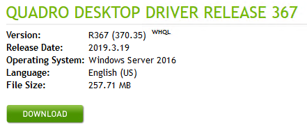

After the drive is successfully installed, you will be prompted to restart the computer. You can do so now. After Windows is restarted, wait a few minutes, then connect back via RDP.

## Step 9E: Disable Microsoft Basic Display Adapter

Disable Microsoft Basic Display Adapter to ensure that we always use NVIDIA graphics driver.

Open Device Manager, right-click Microsoft Basic Display Adapter, choose "Disable":

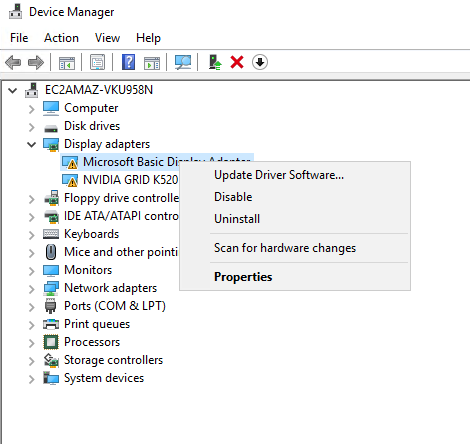

## Step 9F: Start and Enable Windows Audio Service

Go to Administrative Tools | Services, select Windows Audio service. Start and enable it (on Automatic mode):

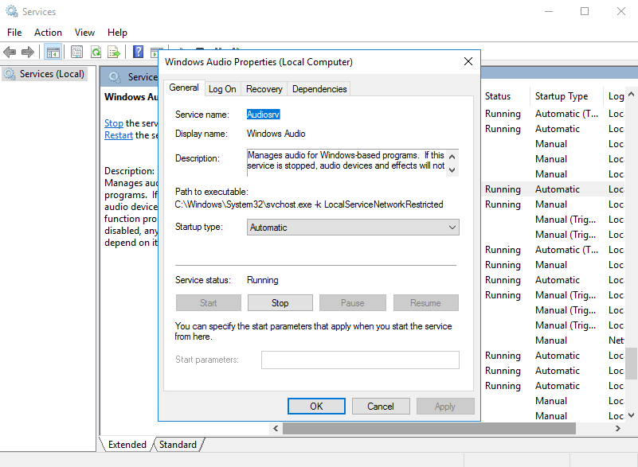

## (Optional) Step 9G: Install NotePad++

This step is optional, but recommended. You may need to modify some game settings file. For that, a decent text editor is very useful.

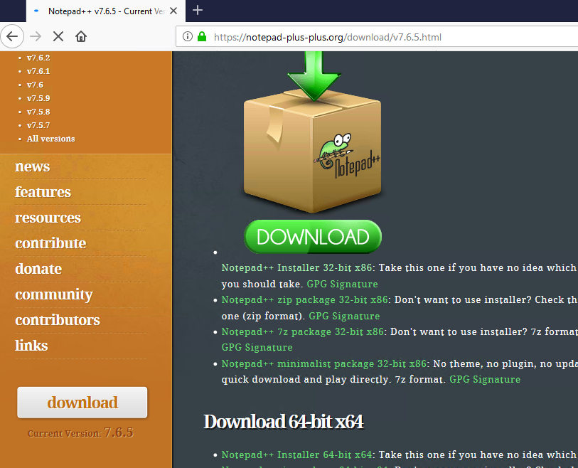

## (Optional) Step 9H: Change Documents Folder Location

This step is optional too, but necessary if your game stores any data in the Documents folder. From Windows Explorer, right click Documents folder, choose Properties, and go to Location tab. Select Move, and point it to D: drive. This ensure that the data is stored in the EBS volume, and survive instance termination.

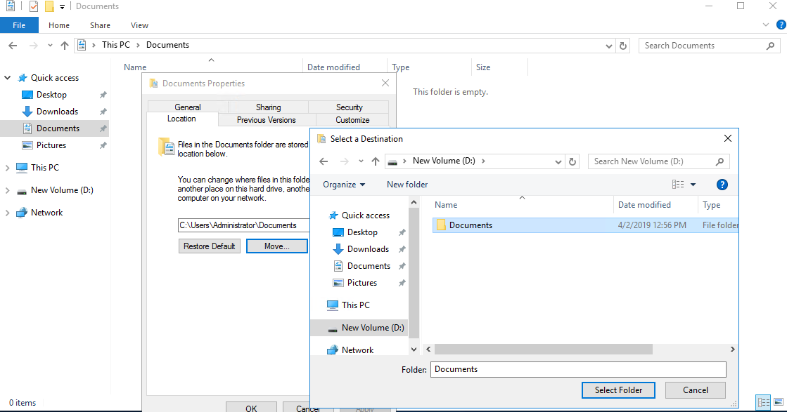

## Step 9I: Download and Install Steam

Go to www.steampowered.com to download and then install Steam.

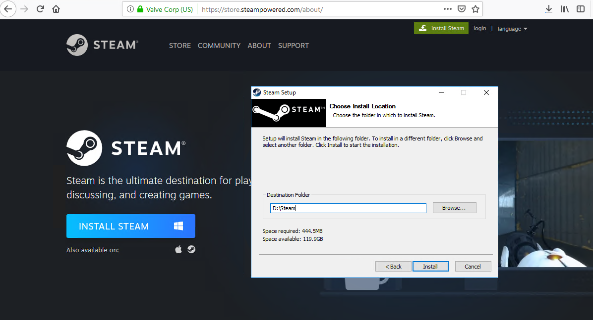

Once Steam is installed, launch it and log in to your Steam account.

## Step 9J: Download and Install the Game

You will see your games collection. Download and install the game of your choice.

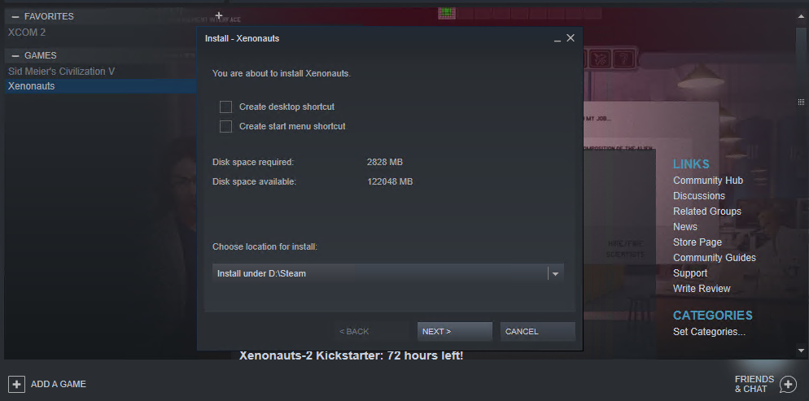

## Step 9K: Test the Game

Before we wrap up the instance preparation, test the game and ensure it can run successfully!

Some games might crash when run via RDP connection. To solve that, refer to your game's support or documentation to configure it to run in windowed mode. Xenonauts, for instance, allow you to configure windowed mode before you launch the game.

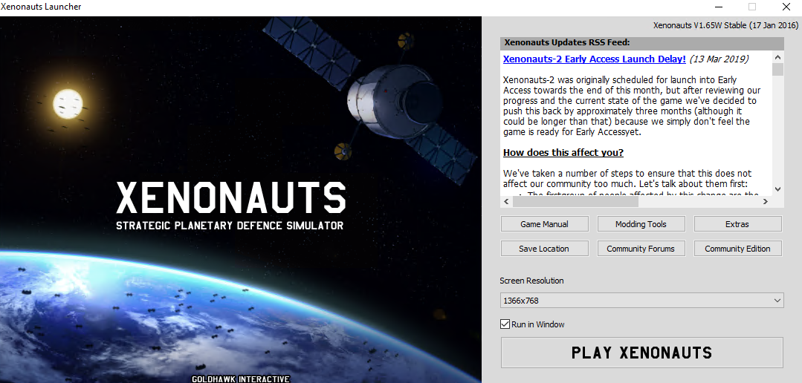

It runs smoothly:

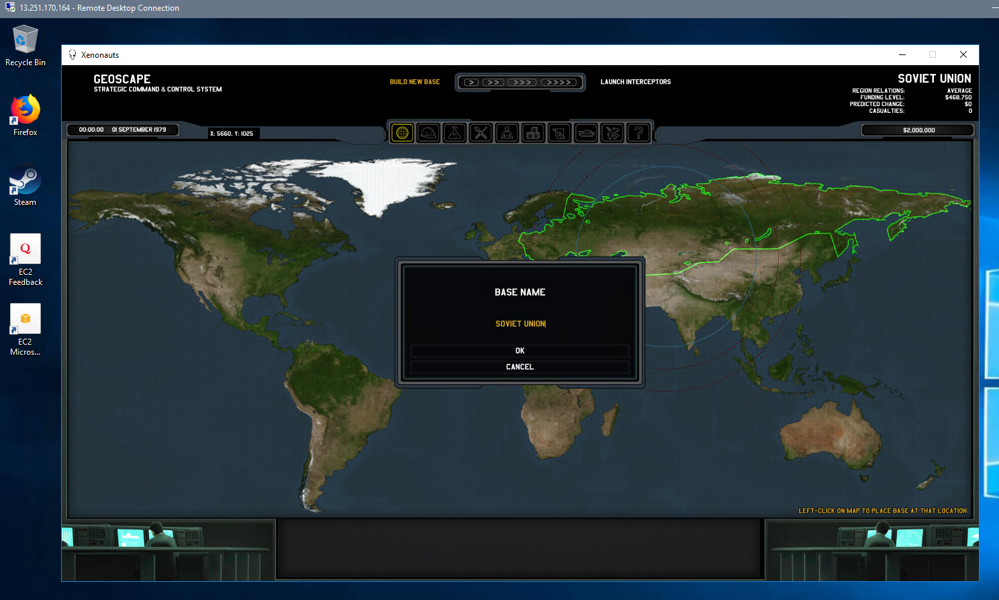

## Step 9L: Disconnect from RDP

Once you're done testing, disconnect from RDP.

# Step 10: Stop the Instance and Detach the EBS Volume

Back to EC2 console, Stop the instance:

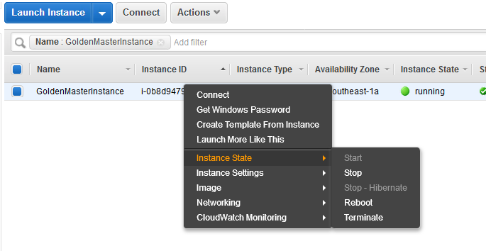

And detach the EBS volume. This is **very** important, to ensure that the EBS volume will not be part of the AMI we are going to create:

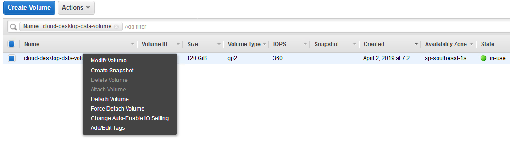

# Step 11: Create a Golder Master Image

Right click the instance, and choose Image | Create Image:

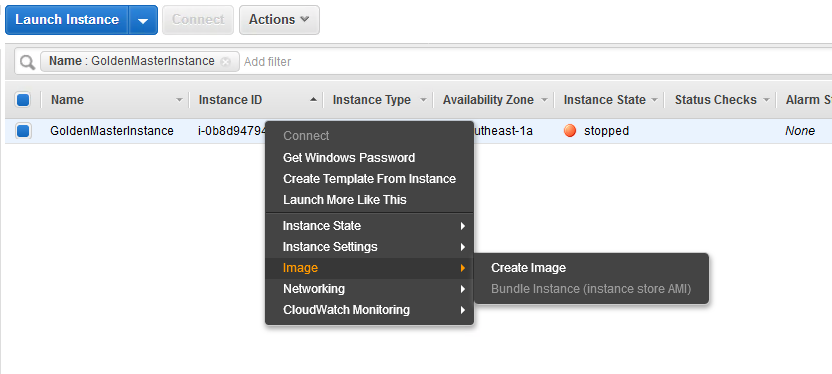

Verify and ensure that :

- Primary volume delete on termination is checked
- The EBS volume created in previous step is not part of the AMI. Only primary volume included

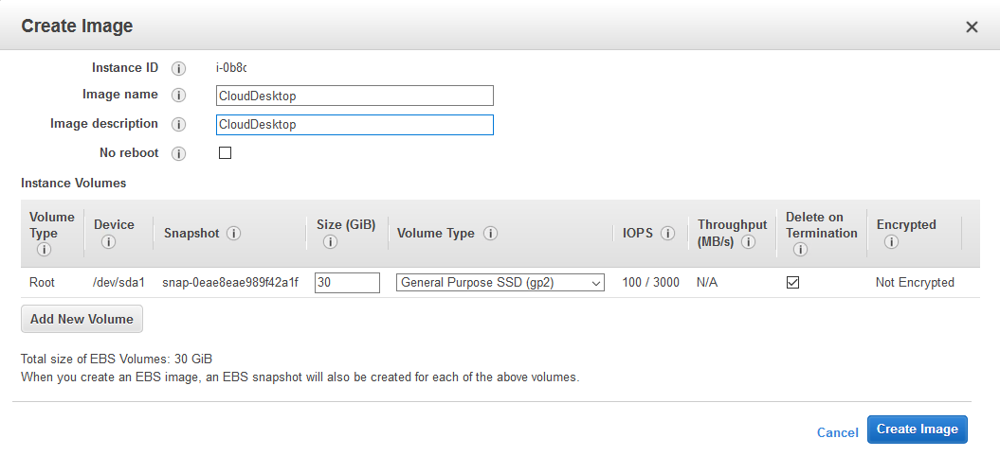

Wait until the AMI is in `available` state.

# It's Time to Play!

## (Optional) Step 1: Check Recent Spot Pricing

Before you start playing, might be a good idea to check the pricing history of the Spot instance. You should get a similar price point when actually sending out the Spot Request.

Example command:
```
aws ec2 describe-spot-price-history --profile default --region ap-southeast-1 `
	--instance-types g2.2xlarge `
	--start-time ((get-date).ToUniversalTime()).ToString("yyyy-MM-ddTHH:mm:ssZ") `
	--product-descriptions="Windows" `
	--query 'SpotPriceHistory[*].{az:AvailabilityZone, price:SpotPrice}'
```

Example output:
```
[
    {
        "az": "ap-southeast-1b",
        "price": "0.460000"
    },
    {
        "az": "ap-southeast-1a",
        "price": "0.460000"
    }
]
```

## Step 2: Send a Spot Request

Before sending a Spot Request, we need to create a launch specification file, which is a JSON formatted text file specifying the AMI, security group, instance type, and subnet ID.

Create a file similar to the following. Adjust the resource IDs, and then save as `launchspec.json`: 

```
{
	"SecurityGroupIds": ["sg-12345678901234567"],
	"ImageId":"ami-12345678901234567",
	"InstanceType":"g2.2xlarge",
	"SubnetId": "subnet-8ece90e9"
}
```

You have two options of sending Spot request types: regular Spot Instance, or defined-duration (also called Spot-block). Regular Spot Instance pricing is lower than Spot-block. But you get higher chance of being interrupted.

To get an idea of how much the current Spot pricing for each option, refer to this page:

https://aws.amazon.com/ec2/spot/pricing/

To get an idea of the probability of your instance getting interrupted, refer to this page:

https://aws.amazon.com/ec2/spot/instance-advisor/

To send a regular Spot request:

```
aws ec2 request-spot-instances --profile default --region ap-southeast-1 `
    --spot-price 0.46 `
	--instance-count 1 `
	--launch-specification file://launchspec.json `
	--type one-time
```

In the above example, we specify `0.46` as the `spot-price`, which is the price we want to bid. If your bid is successful, you will get an instance.

To send a Spot-block request:

```
aws ec2 request-spot-instances --profile default --region ap-southeast-1 `
	--block-duration-minutes 60 `
	--instance-count 1 `
	--launch-specification file://launchspec.json `
	--type one-time
```

In the above example, we specify `60` as the `block-duration-minutes` which indicates that we want the instance to run for an hour. Adjust this as needed. You can specify a duration of 1, 2, 3, 4, 5, or 6 hours (in minutes).

Example output:

```
{
    "SpotInstanceRequests": [
        {
            "BlockDurationMinutes": 60,
            "CreateTime": "2019-04-02T09:11:35.000Z",
            "LaunchSpecification": {
                "SecurityGroups": [
                    {
                        "GroupName": "cloud-gaming-desktop-secgroup",
                        "GroupId": "sg-12345678901234567"
                    }
                ],
                "ImageId": "ami-12345678901234567",
                "InstanceType": "g2.2xlarge",
                "Placement": {
                    "AvailabilityZone": "ap-southeast-1a"
                },
                "SubnetId": "subnet-12345678",
                "Monitoring": {
                    "Enabled": false
                }
            },
            "ProductDescription": "Windows",
            "SpotInstanceRequestId": "sir-dryi1gcm",
            "SpotPrice": "1.160000",
            "State": "open",
            "Status": {
                "Code": "pending-evaluation",
                "Message": "Your Spot request has been submitted for review, and is pending evaluation.",
                "UpdateTime": "2019-04-02T09:11:35.000Z"
            },
            "Type": "one-time",
            "InstanceInterruptionBehavior": "terminate"
        }
    ]
}
```

## (Optional) Step 3: Check the Spot Request Fulfillment

After a Spot request is sent, you can check the status by sending DescribeSpotInstanceRequests API:

```
aws ec2 describe-spot-instance-requests --profile isengard --region ap-southeast-1 --filter Name=state,Values=active
```

The output will look like the following:

```
{
    "SpotInstanceRequests": [
        {
            "ActualBlockHourlyPrice": "0.660000",
            "BlockDurationMinutes": 60,
            "CreateTime": "2019-04-02T09:11:35.000Z",
            "InstanceId": "i-12345678901234567",
            "LaunchSpecification": {
                "SecurityGroups": [
                    {
                        "GroupName": "cloud-gaming-desktop-secgroup",
                        "GroupId": "sg-12345678901234567"
                    }
                ],
                "ImageId": "ami-12345678901234567",
                "InstanceType": "g2.2xlarge",
                "Placement": {
                    "AvailabilityZone": "ap-southeast-1a"
                },
                "SubnetId": "subnet-12345678",
                "Monitoring": {
                    "Enabled": false
                }
            },
            "LaunchedAvailabilityZone": "ap-southeast-1a",
            "ProductDescription": "Windows",
            "SpotInstanceRequestId": "sir-dryi1gcm",
            "SpotPrice": "1.160000",
            "State": "active",
            "Status": {
                "Code": "fulfilled",
                "Message": "Your spot request is fulfilled.",
                "UpdateTime": "2019-04-02T09:11:36.000Z"
            },
            "Tags": [],
            "Type": "one-time",
            "ValidUntil": "2019-04-09T09:11:35.000Z",
            "InstanceInterruptionBehavior": "terminate"
        }
    ]
}
```

The `fulfilled` status means Spot instances have successfully been launched. Check the value of `ActualBlockHourlyPrice` for the actual hourly-rate you are paying. The `InstanceId` is important here, note it down as you will be using it in the subsequent steps.

## Step 4: Attach the EBS Volume

Attach the EBS volume to the instance.

Example command:

```
aws ec2 attach-volume --profile isengard --region ap-southeast-1 `
	--volume-id vol-12345678901234567 `
	--device xvdf `
	--instance-id i-12345678901234567
```

Example output:

```
{
    "AttachTime": "2019-04-02T09:15:57.353Z",
    "Device": "xvdf",
    "InstanceId": "i-12345678901234567",
    "State": "attaching",
    "VolumeId": "vol-12345678901234567"
}
```

## (Optional) Step 5: Associate the Elastic IP Address

If you have provisioned an EIP in Preparation Step 4, you can associate it to the instance.

Example command:

```
aws ec2 associate-address --profile isengard --region ap-southeast-1 `
	--allocation-id eipalloc-12345678901234567 `
	--instance-id i-12345678901234567
```

Example output:

```
{
    "AssociationId": "eipassoc-12345678901234567"
}
```

## Step 6: Connect to the Instance via RDP

Connect to the Instance via RDP. Recall the Administrator password and public IP from previous steps.

## (Optional) Step 7: Ensure the EBS volume is mounted as D: drive

Windows will usually mount a known volume and partition automatically. But if not, you can launch Disk Management to ensure that the EBS volume is online, and that the partition is assigned D: drive letter. 

## Step 8: Launch Steam and start playing

Launch Steam app, and start the game!

Here it is again:


## Clean up

Spot-block instances will be automatically terminated after the specified duration. You can also Terminate the instance from EC2 console. In these scenarios, the EBS volume will survive termination as it will be detached and will be back into `available` state. 

You can also Shutdown the instance from within Windows and it will be stopped. In this case, the EBS volume will stay attached to the instance, until it is terminated.

  