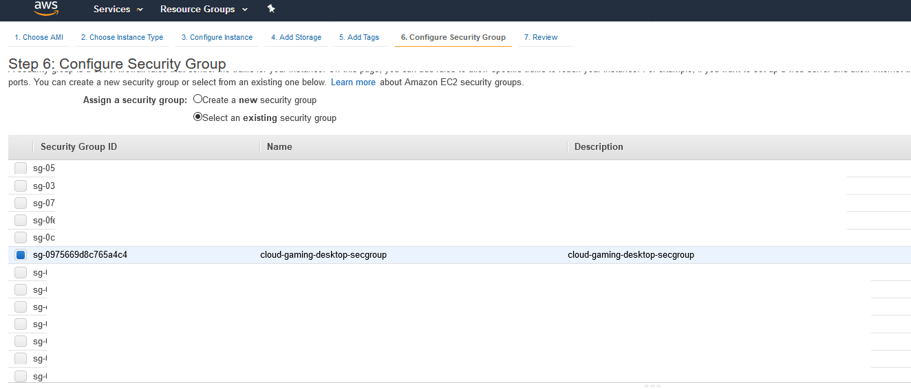
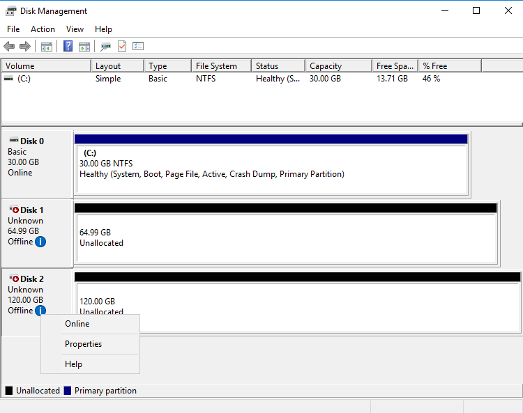

# diy-cloud-gaming-desktop

This is a proof of concept of using AWS GPU instance and Spot-block to build a powerful and cost-effective Steam-powered cloud gaming desktop.

AWS G family instance types are optimized for graphics-intensive application such as 3D visualizations, mid to high-end virtual workstations, virtual application software, 3D rendering, application streaming, video encoding, gaming, and other server-side graphics workloads.

[Announced](https://aws.amazon.com/blogs/aws/build-3d-streaming-applications-with-ec2s-new-g2-instance-type/) in 2013, G2 instance type has the following specification:
- NVIDIA GRID (GK104 “Kepler”) GPU (Graphics Processing Unit), 1,536 CUDA cores and 4 GB of video (frame buffer) RAM.
- Intel Sandy Bridge processor running at 2.6 GHz with Turbo Boost enabled, 8 vCPUs (Virtual CPUs).
- 15 GiB of RAM.
- 60 GB of SSD storage.

NVIDIA GRID GPUs are optimized for graphics rendering accuracy. However, it is also powerful enough to play modern games. Maybe not the most cost-effective graphic platform to play games, but you can do it.

In Singapore (ap-southeast-1) region, G2 Windows instance is offered at $1.16 per hour for on-demand pricing. This price point may look cheap at a glance ("hey, it's just a buck!"), but if you will be using it for many hours, it adds up and you may end up with a bill shock. If I use it 20 hours in a month, I will be paying $23.2.

To get a big EC2 discount, we can utilize Spot instance. In my experience, the Spot pricing for g2.2xlarge can be as low as $0.46. I often got $0.66 during non-peak hour. If I use it 20 hours in a month, I would be paying only $13.2. Now, this is way more affordable!

When an instance is launched from Spot request, it is launched from an image (AMI). This means, the underlying EBS volumes are restored from snapshots, including the primary (boot) volume and any additional block devices in the mapping.

Taken from https://docs.aws.amazon.com/AWSEC2/latest/UserGuide/ebs-initialize.html:

```
New EBS volumes receive their maximum performance the moment that they are available and do not require initialization (formerly known as pre-warming). However, storage blocks on volumes that were restored from snapshots must be initialized (pulled down from Amazon S3 and written to the volume) before you can access the block. This preliminary action takes time and can cause a significant increase in the latency of an I/O operation the first time each block is accessed. For most applications, amortizing this cost over the lifetime of the volume is acceptable. Performance is restored after the data is accessed once.

You can avoid this performance hit in a production environment by reading from all of the blocks on your volume before you use it; this process is called initialization. For a new volume created from a snapshot, you should read all the blocks that have data before using the volume. 
```

For small volumes, initializing EBS snapshot is okay. However, when the volume is large, initialization will take too much time and will eat up your gaming time! Game binaries are huge these days.

To workaround this situation, we can decouple the game data from the AMI. Game data will be stored in a persistent EBS volume, which isn't part of the AMI. When the Spot instance is launched, the same EBS volume is attached and assigned drive letter D.

It's also important that save data is decoupled from the AMI too, so it is safe from instance termination. Some games these days stores data in "Documents" folder. In that case, we can move the underlying location of this folder to D: drive.

Those who have plenty of experiences using AWS and configuring Windows OS will know how to do the above. The rest of the guide is provided for those who don't, and wish to know how this works.

# Disclaimer

This guide is intended for people who already have decent experience of using AWS and understand what they are doing.

I will not be responsible for any issues or cost incurred as a result of following (or not following) the steps in this document. Use this guide at your own risk.

# Pre-Requisites

## Choose the Closest AWS Region to You

Latency and bandwidth will be one of the key constraints of any cloud-based desktop. Choose an AWS region closest to you.

After logging in to your AWS account, choose the region at the top right corner.


## AWS CLI installed and configured


# (Optional) Create a KeyPair


# Step : Create a Security Group



# Step : Create an EBS Volume for Storing Game Data


Note down the EBS volume ID, e.g vol-12345678901234567

# (Recommended) Step : Allocate an Elastic IP Address


Note down the EIP allocation ID, e.g. eipalloc-12345678901234567

# Step : Start a g2.2xlarge Instance for Imaging Purpose


# Step : Associate the Elastic IP to the Instance


# Step : Attach the EBS Volume to the Instance


# Step : Decrypt Administrator Password


# Step : Configure the Instance

## Connect to the Instance via RDP


## (Recommended) Install Mozilla Firefox


## Prepare the EBS Volume Drive

diskmgmt.msc



 MBR partition style


Max size

Assign drive letter D

Format as NTFS (Quick Format)

## Install NVIDIA Graphics Driver

https://docs.aws.amazon.com/AWSEC2/latest/WindowsGuide/install-nvidia-driver-windows.html


Restart

## Disable Microsoft Basic Display Adapter

Open Device Manager


## Start and Enable Windows Audio Service


## (Optional) Install NotePad++


## Change Documents Folder Location


## Download and Install Steam


## Download and Install the Game


## Test the Game


# Step : Stop the Instance and Detach the EBS Volume


# Step : Create a Golder Master Image


Primary volume delete on termination

Wait until the AMI is in `available` state.

# How to Use

## (Optional) Step : Check Recent Spot Pricing

```
aws ec2 describe-spot-price-history --profile default --region ap-southeast-1 `
	--instance-types g2.2xlarge `
	--start-time ((get-date).ToUniversalTime()).ToString("yyyy-MM-ddTHH:mm:ssZ") `
	--product-descriptions="Windows" `
	--query 'SpotPriceHistory[*].{az:AvailabilityZone, price:SpotPrice}'
```

```
[
    {
        "az": "ap-southeast-1b",
        "price": "0.460000"
    },
    {
        "az": "ap-southeast-1a",
        "price": "0.460000"
    }
]
```

## Step : Send a Spot-block Request

```
aws ec2 request-spot-instances --profile default --region ap-southeast-1 `
	--block-duration-minutes 60 `
	--instance-count 1 `
	--launch-specification file://launchspec.json `
	--type one-time
```

```
{
    "SpotInstanceRequests": [
        {
            "BlockDurationMinutes": 60,
            "CreateTime": "2019-04-02T09:11:35.000Z",
            "LaunchSpecification": {
                "SecurityGroups": [
                    {
                        "GroupName": "secgrp-default-ec2-sin1",
                        "GroupId": "sg-040352b5cf578683b"
                    }
                ],
                "ImageId": "ami-0586c2a3967f51648",
                "InstanceType": "g2.2xlarge",
                "Placement": {
                    "AvailabilityZone": "ap-southeast-1a"
                },
                "SubnetId": "subnet-8ece90e9",
                "Monitoring": {
                    "Enabled": false
                }
            },
            "ProductDescription": "Windows",
            "SpotInstanceRequestId": "sir-dryi1gcm",
            "SpotPrice": "1.160000",
            "State": "open",
            "Status": {
                "Code": "pending-evaluation",
                "Message": "Your Spot request has been submitted for review, and is pending evaluation.",
                "UpdateTime": "2019-04-02T09:11:35.000Z"
            },
            "Type": "one-time",
            "InstanceInterruptionBehavior": "terminate"
        }
    ]
}
```

## (Optional) Step : Check the Spot Request Fulfillment

```
aws ec2 describe-spot-instance-requests --profile isengard --region ap-southeast-1 --filter Name=state,Values=active
```

```
{
    "SpotInstanceRequests": [
        {
            "ActualBlockHourlyPrice": "0.660000",
            "BlockDurationMinutes": 60,
            "CreateTime": "2019-04-02T09:11:35.000Z",
            "InstanceId": "i-0f28a35e97e34dbb3",
            "LaunchSpecification": {
                "SecurityGroups": [
                    {
                        "GroupName": "secgrp-default-ec2-sin1",
                        "GroupId": "sg-040352b5cf578683b"
                    }
                ],
                "ImageId": "ami-0586c2a3967f51648",
                "InstanceType": "g2.2xlarge",
                "Placement": {
                    "AvailabilityZone": "ap-southeast-1a"
                },
                "SubnetId": "subnet-8ece90e9",
                "Monitoring": {
                    "Enabled": false
                }
            },
            "LaunchedAvailabilityZone": "ap-southeast-1a",
            "ProductDescription": "Windows",
            "SpotInstanceRequestId": "sir-dryi1gcm",
            "SpotPrice": "1.160000",
            "State": "active",
            "Status": {
                "Code": "fulfilled",
                "Message": "Your spot request is fulfilled.",
                "UpdateTime": "2019-04-02T09:11:36.000Z"
            },
            "Tags": [],
            "Type": "one-time",
            "ValidUntil": "2019-04-09T09:11:35.000Z",
            "InstanceInterruptionBehavior": "terminate"
        }
    ]
}
```

## Step : Attach the EBS Volume

```
aws ec2 attach-volume --profile isengard --region ap-southeast-1 `
	--volume-id vol-12345678901234567 `
	--device xvdf `
	--instance-id i-12345678901234567
```

```
{
    "AttachTime": "2019-04-02T09:15:57.353Z",
    "Device": "xvdf",
    "InstanceId": "i-0f28a35e97e34dbb3",
    "State": "attaching",
    "VolumeId": "vol-0e96efd433c89de64"
}
```

## (Optional) Step : Associate the Elastic IP Address

```
aws ec2 associate-address --profile isengard --region ap-southeast-1 `
	--allocation-id eipalloc-12345678901234567 `
	--instance-id i-12345678901234567
```

```
{
    "AssociationId": "eipassoc-09fa28bd19ea569c8"
}
```

## 

## Step : Connect to the Instance via RDP

## Step : 

# Cost Calculation
